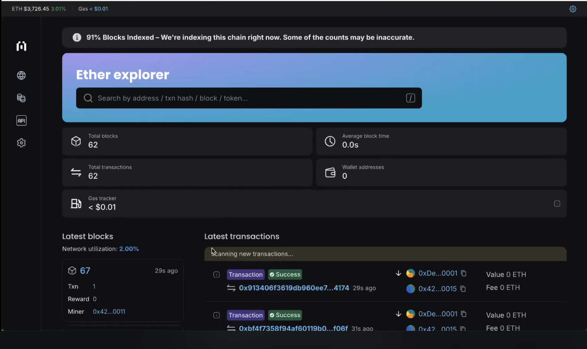

# Cloud RaaS - Cloud Rollup Service 

[Mission Link](https://gov.optimism.io/t/ready-to-vote-decentralized-rollup-as-a-service/7467)

Welcome to the **Cloud Rollup as a Service (Cloud RaaS)** implementation, a comprehensive solution to deploy and manage rollups on the cloud. This project offers a robust and scalable framework for deploying rollups, complete with CLI tools and a built-in block explorer. 

The project is designed to simplify rollup deployment, making it accessible to developers and organizations while maintaining transparency and operational efficiency. 

For a comprehensive understanding of the project, we encourage you to explore the [Research Document](https://github.com/wakeuplabs-io/op-ruaas/blob/docs/docs/research.md).

## Introduction 

Cloud RaaS provides the following features: 
1. **Research and Specification**: A detailed investigation of cloud rollup infrastructure requirements and possible solutions. 
2. **Rollup Deployment**: Source code to deploy cloud rollups based on infrastructure specifications or alternative solutions. 
3. **CLI Tool**: A command-line interface for creating rollups as a service, simplifying deployment processes. 
4. **Block Explorer Integration**: An integrated block explorer to enhance visibility and debugging for the deployed rollups. 

## Deliverables 

- [Research Document](https://github.com/wakeuplabs-io/op-ruaas/blob/docs/docs/research.md)
- [Source Code for Rollup Deployment](https://github.com/wakeuplabs-io/op-ruaas)
- [CLI Source Code and Package](https://github.com/wakeuplabs-io/op-ruaas)
- [NPM package](https://www.npmjs.com/package/@wakeuplabs/opruaas)
- [Npm package guide](https://www.npmjs.com/package/@wakeuplabs/opruaas)

## User Guide 

### Steps to Use Cloud RaaS 

1. **Install package**
    - Install with `npm i -g @wakeuplabs/opruaas`
2. **Available commands**

- `new` Create a new project, template config file, and folders
- `init` Initialize a new project
- `build` Compile sources and create Docker images
- `release` Tag and push the already built Docker images to the registry for deployment
- `dev` Spin up a local development environment
- `deploy` Deploy your blockchain. Target must be one of: contracts, infra, all
- `inspect` Get details about the current deployment. Target must be one of: contracts, infra
- `help` Print this message or the help for the given subcommand(s)

3. **Deploy a Rollup** 
   - Use the provided source code or CLI to deploy a rollup on your preferred cloud provider. 

4. **Monitor Using Block Explorer** 
   - Access the block explorer to track rollup activity and troubleshoot as needed. 

## Demo Preview 

A video showing all the steps to create a rollup with the CLI is shown as follows:

[Demo Link](https://drive.google.com/file/d/12hQbNaxR5aQublGj9sV8BKg2YZcB2sQT/view?usp=sharing
)
<iframe src="https://drive.google.com/file/d/12hQbNaxR5aQublGj9sV8BKg2YZcB2sQT/preview" width="640" height="480" allow="autoplay"></iframe>

On the other hand, the following image is the block explorer of the demo rollup.

Made with ❤️ by the WakeUp Labs team 