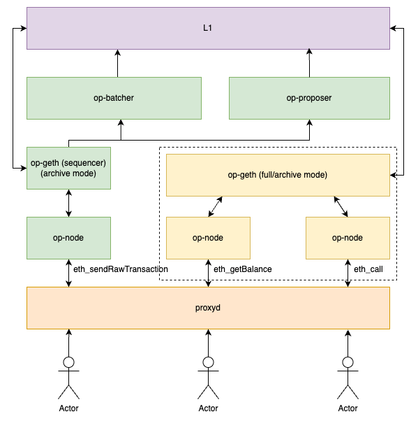
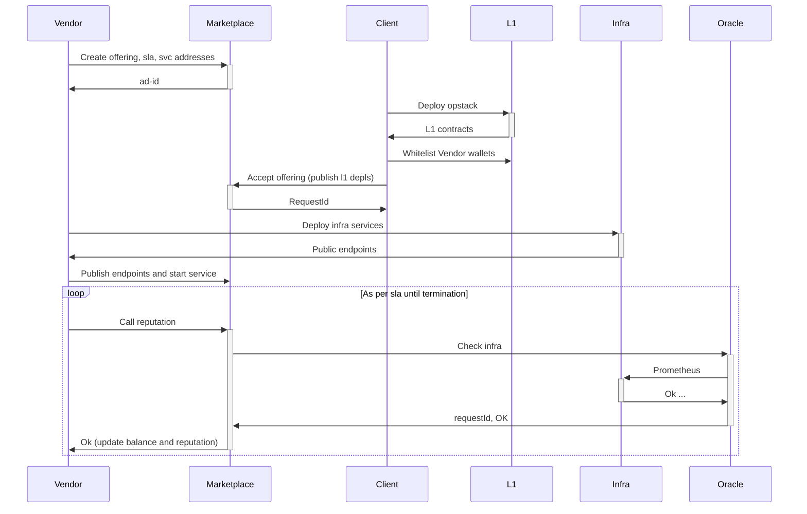
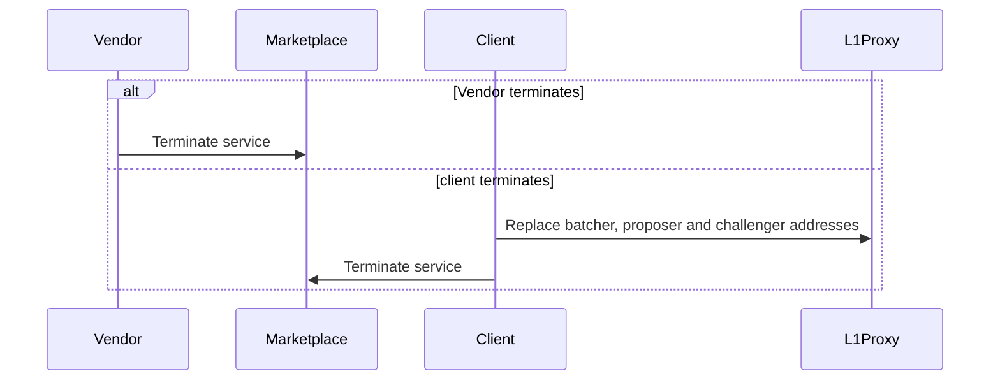

# Research & Discovery

## Summary

This document outlines the research process, problem-solving approaches, and decision-making journey for the development of Ruaas, a Rollup as a Service solution.

## Purpose

The objective of this project is to provide users with a seamless way to deploy and manage their own rollups across various cloud providers. The solution will include a Command Line Interface (CLI) and a web-based development console for comprehensive management. By eliminating vendor lock-in, we enable users to retain full ownership of their rollups, offering the flexibility to switch cloud providers with minimal hassle.

# Ruaas cli

## Problem statement + Context

Optimism's long-term vision is to enable dApps to seamlessly operate across multiple rollup chains, with ease and speed.

While Optimism has already developed powerful tools to reduce barriers and the technical knowledge required, the process still isn't as simple as it could be. Many existing solutions involve intermediaries that, unfortunately, dilute ownership and customization options for users.

Our goal is to empower developers who want to leverage the full potential of the Superchain. We aim to provide an open, user-friendly tool that allows developers to easily deploy and manage their own rollups.

While current tools excel in certain areas, they often fall short in others. They provide valuable building blocks, but none offer a comprehensive, end-to-end solution—something this project intends to address.

## Alternatives Considered

### 0xFableOrg/roll-op

**Pros:**

- Functional implementation: it's the only solution we've been able to run locally without significant debugging.
- Out-of-the-box integration of BlockScout as a block explorer.
- Still an unmerged PR but if approved would include support for latest versions of optimism.
- Quick spin up of dev command to try it all locally.

**Cons:**

- Written in Python, which could lead us to rely on Python for the entire development process—a choice we wish to avoid due to concerns over performance and code quality.
- Tied to a specific version of the source code, with no straightforward way to support additional versions.
- Deploys contracts from the same release used to build the binaries, which contradicts best practices outlined in the official documentation.
- Does not provide tools for infrastructure deployment and management.

**Source:**

- [0xFableOrg/roll-op GitHub Repository](https://github.com/0xFableOrg/roll-op)

### upnodedev/opstack-compose

**Pros:**

- Provides a DevOps solution using Docker Compose and AWS, making it suitable for blockchain infrastructure.
- Focuses on blockchain infrastructure, offering significant value.
- Integrates BlockScout as a block explorer out of the box.
- Includes deployment examples that can serve as inspiration for our own setup.

**Cons:**

- Does not work out of the box and requires modifications.
- The hardcoded build process limits flexibility, particularly in version management.
- Deploys contracts from the same release used to build the binaries, which contradicts best practices outlined in the official documentation.

**Source:**

- [upnodedev/opstack-compose GitHub Repository](https://github.com/upnodedev/opstack-compose)

### optimism/op-deployer

**Pros:**

- Developed and maintained by Optimism, ensuring alignment with their official tools.
- Leverages the [OPCM](https://github.com/ethereum-optimism/design-docs/blob/main/protocol/op-contracts-manager-arch.md), significantly simplifying contract deployments.

**Cons:**

- Still in the early stages for our use case, with limited documentation and examples available.
- Primarily focused on contract deployment, rather than complete rollup management.
- Currently relies on a deployment script, limiting flexibility.
- Does not address broader infrastructure deployment and management needs.

**Source:**

- [optimism/op-deployer Documentation](https://docs.optimism.io/builders/chain-operators/tools/op-deployer)

## Proposed Solutions

We have decided to develop our own CLI and infrastructure tooling to create a more flexible deployment process and address the challenges we encountered with existing solutions. Given the difficulties in getting current solutions to work smoothly and the relatively short time needed to replicate their functionality, our development will not only address these issues but also support new requirements, including a user interface and scalable deployment.


## Decisions and Drivers

### General

- We will develop a CLI to handle deployments.
- A Web UI will be created to facilitate quick and easy project spin-ups.
- We have chosen Rust for its exceptional performance, reliability, and scalability. As Rust continues to gain significant traction in the developer community, we see it as the ideal language to ensure the long-term success of our solutions. Rust's growing ecosystem and active support make it a cornerstone of our development strategy, guaranteeing robust and efficient code for critical infrastructure.

### CLI

- The CLI will provide local self-service capabilities.
- It will be built as an implementation of a core Rust package that manages the business logic for creating the blockchain. This approach allows for testable code and enables multiple client implementations, including the cli and server themselves. Rust's powerful features, such as memory safety and concurrency handling, make it the perfect choice for building a performant and secure solution.
- Binaries will be distributed via GitHub releases and made widely accessible through an npm package that consumes them.
- To ensure a flexible build process, we will avoid hardcoding the build steps, as seen in many current solutions. Instead, we will pull Docker files into the infrastructure directory (shown below), allowing us to support most use cases while staying adaptable for custom configurations. This approach reduces dependencies to essentially Docker.
- Sources will be downloaded directly from GitHub releases.

#### Commands Provided

- `new`: Creates a new folder with a template configuration for the user to review and run. This will generate the following files: `.env`, `config.toml`, `README.md`, `.gitignore`, etc.

- `init`: Downloads the sources and infrastructure based on the configuration specified by the user.

- `build <artifact>`: Compiles the specified artifacts and generates the corresponding Docker image.

- `release <artifact>`: Publishes the specified artifacts to a docker registry.

- `dev`: Spins up a local l1 node with geth, deploys contracts using the user configuration, and installs the infrastructure Helm chart in a local Kubernetes cluster for testing.

- `deploy <contracts | infra | all>`:

  - `contracts`: Deploys contracts to L1 and generates the necessary files for connecting to it, `genesis.json`, `rollup.json`, etc.
  - `infra`: Creates a kubernetes cluster as leveraging terraform and based on user input configures and installs charts for core (as sequencer or replica), explorer, monitoring, etc.
  - `all`: Deploys contracts and then deploys the infrastructure.
  - With a full configuration, this command can be run on it's own. It will serve as the starting point when accessed from the UI.

- `inspect <contracts | infra>`:

  - `contracts`: Lists deployed contracts and relevant details.
  - `infra`: Displays Terraform outputs, including relevant URLs.

- `monitor <onchain | offchain>`:
  - `onchain`: A wrapper around [monitorism](https://docs.optimism.io/builders/chain-operators/tools/chain-monitoring#monitorism) and [dispute-mon](https://docs.optimism.io/builders/chain-operators/tools/chain-monitoring#dispute-mon), customized for the user’s chain.
  - `offchain`: Provides the URL for the Grafana deployment.

Some commands may depend on others and require local state to be available. We will perform these checks and guide the users accordingly to ensure a smooth process.

Generated project structure

```
deployments/
	deployment-name/
		artifacts/
      contracts_artifacts.zip
      infra_artifacts.zip
    config/
      network.json
      addresses.json
      ...
infrastructure/
  provider/
    aws/
    gcp/
    ...
  images/
    contracts.dockerfile
    node.dockerfile
    ...
	charts/
    opstack/
    blockscout/
    monitoring/
    ...
src/
	contracts/
	node/
	batcher/
  proposer/
  etc...
README.md
config.toml
.gitignore
.env
```

### Infrastructure

- For deployment, we will leverage **Kubernetes** to coordinate all services and enable scaling. We will combine this with **Helm** for simple deployment customization and management, along with **Terraform** to specify resources and provide a seamless one-click experience.
- One key reason for selecting **Kubernetes** over other solutions is its broad compatibility with various cloud providers. This ensures that users can choose where to host their chain while minimizing setup differences. While we will provide Terraform configurations for a few cloud vendors, the Helm chart will be open for users to deploy anywhere they prefer.
- As outlined in the [documentation](https://docs.optimism.io/builders/chain-operators/tools/chain-monitoring#offchain-component-monitoring), we will include **Prometheus** and **Grafana** services in the deployment chart, along with preconfigured dashboards for Grafana. This will provide users with a robust monitoring system out of the box.
- With our rust cli we'll make developments and deployments a one command thing, adjusting values, installing dependencies, waiting for processes, etc.

**Scaling Diagram:**



To ensure the infrastructure scales properly as the chain grows in usage, we will follow the guidelines provided in the [architecture](https://docs.optimism.io/builders/chain-operators/architecture) section of the Optimism documentation.

To allow the sequencer to focus on creating new transactions, we will set up node replicas dedicated to handling read requests. All of this will be powered by **proxyd**, which will:

- Whitelist RPC methods.
- Route RPC methods to groups of backend services.
- Automatically retry failed backend requests.
- Track backend consensus (latest, safe, finalized blocks), peer count, and sync state.
- Re-write requests and responses to enforce consensus.
- Load balance requests across backend services.
- Cache immutable responses from backends.
- Provide metrics to measure request latency, error rates, and more.

Regarding networking, only **proxyd**, **explorer** and **monitoring** services will be exposed.

Building on this, we will also enable the deployment of replica nodes independently. Through a single configuration chart, users will be able to enable or disable the sequencer component, providing flexibility for external users to deploy and manage their own nodes with ease. This feature will be crucial not only for enhancing network scalability and redundancy but also for supporting vendor migrations and ensuring data persistence, as we will discuss further in the following sections.

### Provider Migrations and Backups

To facilitate vendor flexibility and ensure the persistence of blockchain data, we will leverage the distributed nature of the blockchain itself. Our solution will allow users to easily switch between providers by spinning up replica nodes. We will encourage clients to set up these replica nodes from the outset, so that if the primary sequencer encounters issues, already-synced nodes can seamlessly take over the sequencer role. This transition will be governed by on-chain permissions and new payment contract arrangements. Additionally, if needed, new nodes can be launched and synchronized with the existing replica data. These replica nodes will enhance the network’s request capacity, bolster security, and will be open to anyone wishing to participate in running them.

### Block Explorer

For the block explorer, **Blockscout** ([link](https://www.blockscout.com/)) appears to be the best choice. Blockscout is an open-source block explorer that supports OP Stack chains, is recommended by the Optimism documentation, and is widely used in many existing solutions.

### Web Dev Console

The dev console will focus on generating a complete configuration for the user to download and deploy with a single command using the CLI. We will prompt users for input to populate the initial configuration, and then generate a ZIP ready for deployment. This will allow users to simply run `npx opruaas dev` or `npx opruaas deploy` to get started. We'll also do an inspection page where users can submit the result of their deployments to see details about it, addresses, links, etc. We'll leverage the rust core crate to build the initial zip and inspect the deployments, doing this will speed up our development and allow us to create lightweight and fast lambda functions.

## Risks and Uncertainties

1. The system must be sufficiently extensible to accommodate new features.
2. Proper management of upgrades and version control.
3. Consideration of testing environments and their integration.
4. Avoid overwhelming users with complex environment setup requirements.
5. Availability of testnet tokens and proper configuration setup.

# (Optional) Decentralized Marketplace

For users who may not want to run the infrastructure themselves, we offer an optional decentralized marketplace. This provides a closer experience to a one-click rollup solution, while still maintaining decentralization.

## Proposed Solution

We propose the creation of a marketplace contract where users seeking to deploy a blockchain using the Optimism stack can submit requests, and vendors with the necessary infrastructure can fulfill those requests.

## Decisions and Drivers

We will develop a suite of smart contracts to effectively manage the relationship between vendors and clients, fostering a positive and sustainable interaction. Additionally, we will create a frontend application to simplify user interaction with these contracts.

### General

Example marketplace interaction



Example termination



### Marketplace Contract

The marketplace contract will include the following features:

- **Micro-Payments**: The contract will support micro-payments in various tokens for services rendered.
- **Order Submission and Locking**: Vendors will submit offerings by providing unique batcher, proposer, sequencer addresses and SLA terms (e.g., frequency of oracle checks, cost per term, etc.). Clients will accept these offers by submitting their deployment addresses and configuring the vendor's wallets. Once configured, the vendor can proceed with deployment and post the relevant endpoints on-chain to initiate payments.
- **Contract Termination**: Either party can terminate the contract at any time. As per the [security/privileged-roles](https://docs.optimism.io/chain/security/privileged-roles), the chain owner can revoke the vendor's permissions by updating addresses via L1Admin and L2Admin. After this, a new transaction with the marketplace will be required.
- **Reputation System**: A reputation system will be established based on the number of active contracts, contract duration, and oracle calls that monitor service endpoints. Payments will be contingent on successful oracle calls.
- **Service Level Agreement (SLA)**: Customers and vendors will agree on an SLA at the start of the engagement, specifying the frequency and types of metrics the vendor will report through oracles. The initial setup will cover basic metrics but can expand to more detailed proofs as needed. Bigger oracle usage will derive in bigger costs but provide more to consumers. [Chainlink](https://docs.chain.link/any-api/introduction) and [Witnet](https://witnet.io/) will be analyzed for usage in oracle integration, ideally we'll use adapters that leave this decision to the vendors and consumers.

### Dapp

The marketplace will be integrated into the Ruaas website as another page. The main functionality will be to facilitate interactions with the contract:

- **Vendors Create Offerings**: Vendors can submit their service offerings, including terms such as the batcher, proposer, sequencer addresses, SLA details, and cost per term.
- **Clients Accept Offers**: Clients can review vendor offerings and accept them by submitting the necessary data, such as deployment addresses and vendor wallet configurations.
- **Monitoring the Relationship**: Both the vendor and client can monitor the status of their relationship, including balances, health status, and service endpoints. This will allow them to track contract progress and performance in real time.
- **L1 Contract Deployment**: The website can assist in facilitating the deployment of L1 contracts, but the client is ultimately responsible for initiating the deployment and ensuring the security of their Admin keys.

### Vendor migration

For vendor migrations we'll take the same procedure as specified for `Provider Migrations and Backups`. We'll facilitate switching a node from replica to sequencer as well as encouraging the client to spin up those extra replicas from the get go as a safety mode. Our ui will list the nodes the user is paying for and the mode in which they're running.

## Risks and uncertainties

- Given that the CLI makes it very easy to deploy new chains using the Optimism stack, the marketplace will aim to cater to those who do not want to be involved in infrastructure management.

- There may be security concerns related to key management, as there is currently no alternative to providing keys for services such as the batcher, proposer, etc. We rely on the L1Proxy and L2Proxy admin roles, to mitigate potential risks.

- Providing reliable proof of service execution may be challenging. While we aim to cover a broad range of use cases, malicious actors may still find workarounds.

# Roadmap

At this point, we want to assess the feasibility of pursuing the decentralized marketplace. We need to evaluate the required resources and determine what we could achieve if we instead focus on developing the CLI tooling.

Stipulated timelines:

- **Contracts Development**: 5 weeks
- **Contracts Integration** (including cronjob for vendors to call oracles and UI integration): 4 weeks

If decentralized marketplace is not pursued we can instead:

- Generate tutorials, dive deep in chain parameters, provide example configurations for other chains including testnets like Holensky where eth is more available.
- Add more extras like data availability, paymaster setup, bridge ui, etc
- Add more cloud providers, for instance GCP and Azure.
- Add options to switch explorer
- Possibility to run dev method just with docker to further reduce dependencies.
