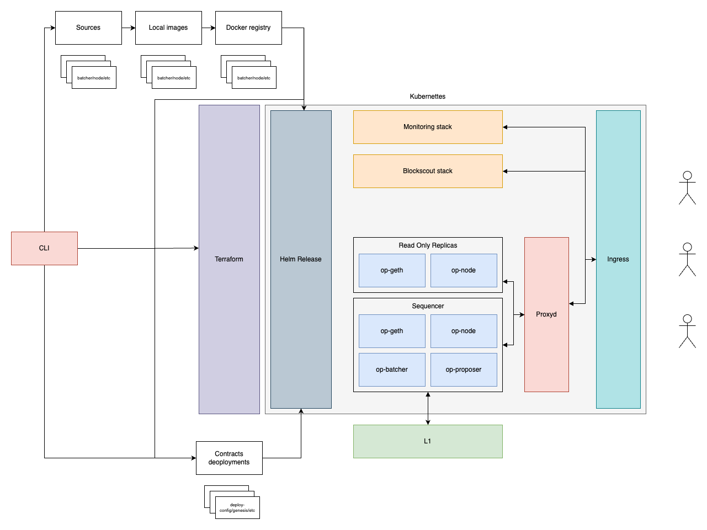
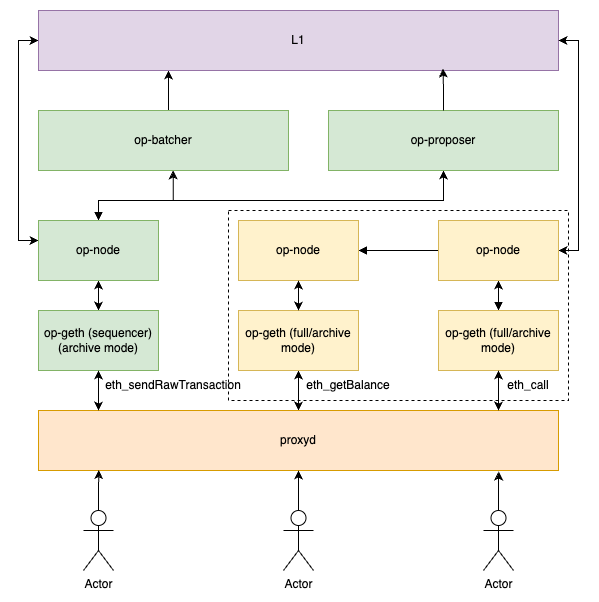

# Research & Discovery

# Summary

This document describes our entire process of research, problem tackling and decision making.

# Purpose

The goal of this project is to enable users to easily deploy and manage their own rollups through cloud providers. The service will include a Command Line Interface (CLI) and a web-based development console for management. By eliminating vendor lock-in, we empower users to fully own their rollups and switch cloud providers with minimal effort.

# Problem statement + Context

Optimism's long-term vision is focused on dApps being able to span as many rollup chains as needed, as easy and as fast as it can be.

So far, Optimism has developed awesome tools to reduce the limitations and knowledge required, but it seems it's still not as easy, since there are providers getting in the middle which end up restricting the users on the matter.

We want to give full power to developers looking forward to make use of the Superchain capabilities, and having an open tool to put up and operate a chain inside Optimism is another step closer to our goal.

Current tools excel on some features and lack others, all of them contribute on gathering ideas, but none of them tackles the problem end to end, which is what this project's mission is about.

# Alternatives considered

### 0xFableOrg/roll-op

Pros:

- Functional implementation; it’s the only one we’ve been able to run locally so far.
- Implements BlockScout as a block explorer out of the box.

Cons:

- Written in Python, which could lead us to use Python for our entire development—a choice we want to avoid, as it often results in heavy lower-quality code.
- Code quality is low; the structure is somewhat messy and poorly organized.
- Tied to a single version of the source code, with no easy way to adapt to additional versions.
- Deploys contracts from the OP node, contrary to the advice in the documentation.
- Lacks bridge deployment capabilities.
- Contains excessive dependencies.
- Does not address infrastructure deployment and management.

Source:

- https://github.com/0xFableOrg/roll-op

### upnodedev/opstack-compose

Pros:

- DevOps solution using Docker Compose and AWS.
- Upnode focuses on blockchain infrastructure, providing more value.
- Implements BlockScout as a block explorer out of the box.
- Offers deployment examples that we can draw inspiration from.

Cons:

- Does not work out of the box.
- Hardcoded build process limits flexibility regarding version attachment.
- Contracts are deployed from the same release used to build the binaries, which can create complications.

Source:

- https://github.com/upnodedev/opstack-compose

### optimism/op-deployer

Pros:

- Developed and maintained by Optimism itself
- Utilizes the [OPCM](https://github.com/ethereum-optimism/design-docs/blob/main/protocol/op-contracts-manager-arch.md) which simplifies contract deployments significantly.

Cons:

- Still in the early stages for our use; limited documentation and usage examples.
- Primarily focused on contract deployment.
- Currently relies on a deployment script.
- Does not address infrastructure deployment and management.

Source:

- https://docs.optimism.io/builders/chain-operators/tools/op-deployer

# Proposed solutions

We have decided to develop our own CLI and infrastructure tooling to create a more flexible deployment process and address some of the inconveniences we encountered while testing existing solutions. Given the challenges in getting current solutions to work easily and the relatively short time required to replicate them, we aim for our development to also meet new requirements, including a user interface and scalable deployment.



# Decisions and drivers

### General

- A CLI that can handle deployments will be developed.
- A Web UI to quickly and easily spin off projects will be created.
- We chose Rust for its performance, cost efficiency, and growing popularity, ensuring reliable and scalable solutions.

### CLI

- CLI for local self-service
- The CLI will be an implementation of a core Rust package that manages the business logic for creating the blockchain. This approach allows us to maintain testable code while also enabling multiple client implementations, including the server itself.
- We'll distribute the binaries through github releases and make them widely available with an npm package.
- To allow for a more flexible build process we'll allow the user to specify the steps in the config file in the shape of:

  ```toml
  [sources.op_node]
  release_tag = "op-node/v1.3.1"
  build = ["make op-node"]

  [sources.op_contracts]
  release_tag = "op-contracts/v1.6.0"
  build = ["pnpm install", "pnpm build", "cd packages/bedrock-contracts", "forge install", "..."]
  ```

  Note this also gives flexibility for patches or cherry picks on top of releases like roll-op does.

- Artifacts will be downloaded from github releases.
- Build processes will all happen within docker images to reduce setup to just docker.

Commands provided:

- `setup`: It'll set up the initial project structure. First it'll ask the user information about the chain to deploy, desired l2ChainId, artifacts versions to use and etc. Then it'll create a started config file for it and set up the `src` and `infra` folder as shown below.
- `build <artifact>`: Compiles each of the artifacts and generates the corresponding docker image.
- `dev`: It'll spin up a local `anvil` testnet node forking the l1 chain, deploy contracts to it using the user configuration and start all the nodes for the user to test his chain locally.
- `deploy <contracts | infra>`:
  - `contracts`: Deploys contracts to l1 and generates `genesis.json` and `rollup.json`
  - `infra`: Publishes images to the user repository, updates the values.yaml from the helm, confirms with the user and applies the terraform config.
  - If no option is provided we'll first deploy the contracts and follow up with the infra.
  - With a full config available, we can run also do a setup and a build from this command. This will be the starting point when coming from the ui.
- `inspect <contracts | infra>`:
  - `contracts`: Lists deployed contracts
  - `infra`: Showcases terraform outputs, indicating relevant urls and statuses. Among others here user will be pointed to monitoring tools.
- `monitor <onchain | offchain>`:
  - `onchain`: Will be a wrappers around [monitorism](https://docs.optimism.io/builders/chain-operators/tools/chain-monitoring#monitorism) and [dispute-mon](https://docs.optimism.io/builders/chain-operators/tools/chain-monitoring#dispute-mon) customized to the user chain.
  - `offchain`: Will be a pointer to the graphana deployment url.

Some commands may depend on others and may require some local state available. We'll do this checks and inform everything to the users to best guide them through the process.

Generated project structure

```
deployments/
	deployment-name/
		artifacts/
		rollup.json
		genesis.json
infra/
	aws/
	gcp/
	helm/
src/
	op_contracts/
	op_node/
	op_geth/
	op_batcher/
	blockscout/
config.toml
.env.local
```

### Infrastructure

- For the deployment we'll leverage `Kubernetes` to coordinate all the services and enable scaling in combination with `Helm` for a simple deployment customization and management plus `Terraform` to specify the resources and allow the one click experience we want.
- One fundamental reasoning behind picking `Kubernetes` over other potential solutions is compatibility with providers, we want users to be capable of selecting where to host their chain and removing small differences in setup k8s seems to be a common 'interface' available. We'll provide `Terraform` just for a few cloud vendors but the helm chart will be open for users to take wherever they want.
- Regarding monitoring as specified in the [docs](https://docs.optimism.io/builders/chain-operators/tools/chain-monitoring#offchain-component-monitoring) we'll include in the deployment chart services for `prometheus` and `graphana` along with dashboards for the last one. This way out of the box users will get a robust monitoring system.

Scaling diagram:



To ensure the infrastructure scales properly when the chain grows in usage we'll follow the indications provided by the [architecture](https://docs.optimism.io/builders/chain-operators/architecture) section in the optimism docs.

In order to let the sequencer focus on creating new transactions we'll set up node replicas that will handle read requests. All this powered by proxyd that:

- Whitelists RPC methods.
- Routes RPC methods to groups of backend services.
- Automatically retries failed backend requests.
- Track backend consensus (latest, safe, finalized blocks), peer count and sync state.
- Re-write requests and responses to enforce consensus.
- Load balance requests across backend services.
- Cache immutable responses from backends.
- Provides metrics to measure request latency, error rates, and the like.

As per networking this implies the only services exposed will be `proxyd` and those for analytics.

### Block explorer

- Block explorer. For the block explorer [Blockscout](https://www.blockscout.com/) appears to be the best choice. BlockScout is an open-source block explorer that supports OP Stack chains, is recommended by the Optimism documentation, and is widely implemented in many current solutions.

### Web dev console

The dev console will focus on generating a full config for the user to download and deploy in one command with the cli. We'll ask users input for filling up the kick off config and generate a zip for them to download and deploy. To achieve this the zip will contain a full config.toml file and the cli binaries so that `./opraas dev` or `./opraas deploy` is all they need.

# Risk and uncertainties

1. It must be sufficiently extensible to handle new features.
2. Upgrades management
3. Contemplate testing environments.
4. Avoid overloading user with environment setup complexities.
5. Testnet tokens availability and proper config setup
